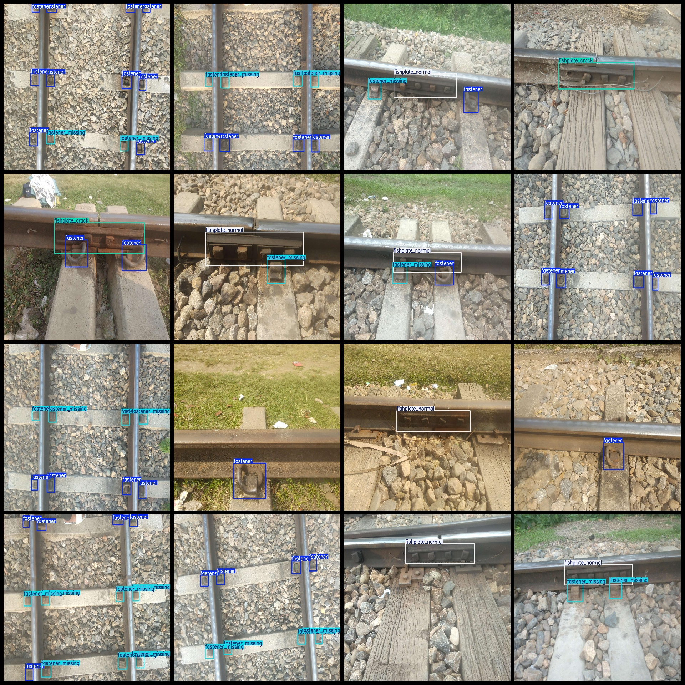
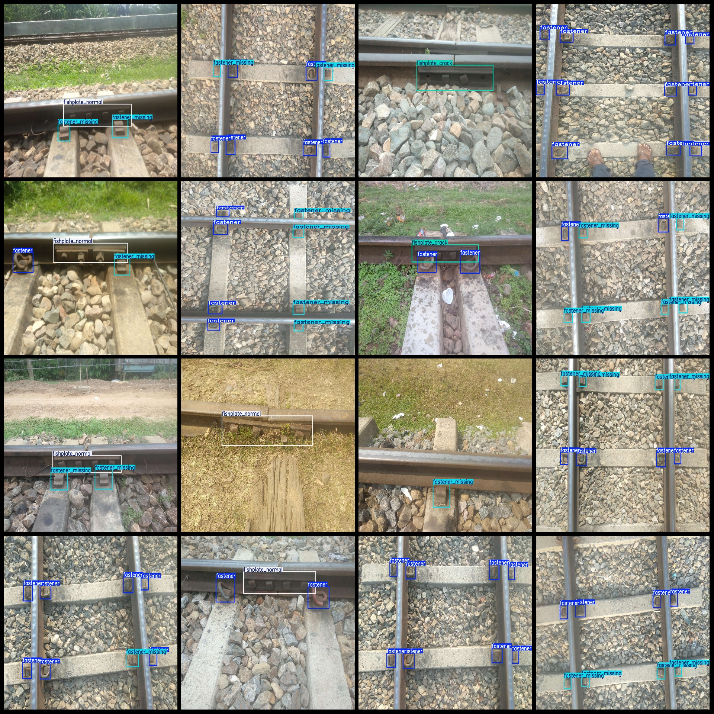

# Intelligent Railway Track Fasteners Defect Detection Dataset (VOC+YOLO)

**Format:** Pascal VOC format + YOLO format (txt files without split paths, only containing jpg images and corresponding VOC-format xml files and YOLO-format txt files)

**Number of Images (jpg files):** 1876

**Number of Annotations (xml files):** 1876

**Number of Annotations (txt files):** 1876

**Number of Annotation Classes:** 4

**Annotation Class Names (not in the order as indicated by the YOLO format, but according to the labels folder 'classes.txt'):** ["fastener", "fastener_missing", "fishplate_crack", "fishplate_normal"]

**Box Counts for Each Category:**
- Fastener (fasteners) box count = 4920, occupying 1172 images
- Fastener_Missing (missing fasteners) box count = 2668, occupying 897 images
- Fishplate_Crack (cracked fishplates) box count = 416, occupying 410 images
- Fishplate_Normal (normal fishplates) box count = 662, occupying 619 images

**Total Box Counts:** 8666

**Image Resolution:** Multi-resolution images, such as 1920x2560, 1920x1440, etc.

**Annotation Tool Used:** labelImg

**Annotation Rules:** Draw a bounding box around each category.

**Important Notice:** The dataset does not have been divided into training, validation, or test sets; you will need to do so yourself.

**Special Disclaimer:** This dataset does not guarantee any accuracy in the trained models or weight files.

**Image Preview:**

## Images

Here is a pay link on Stripe ( https://buy.stripe.com/3cs8yP7sY87d0vu9AB ). Please contact me lonlonago@foxmail.com after funding $89, and I will send you a complete data files , thank you!

